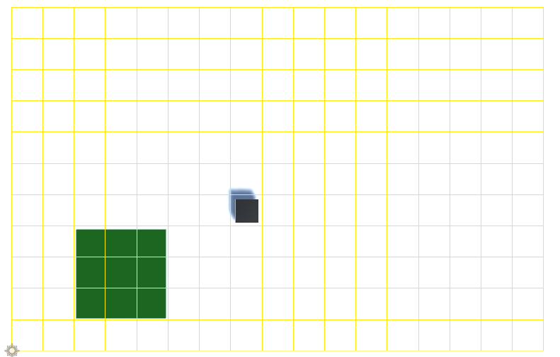
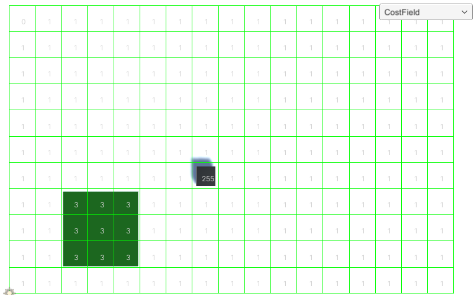
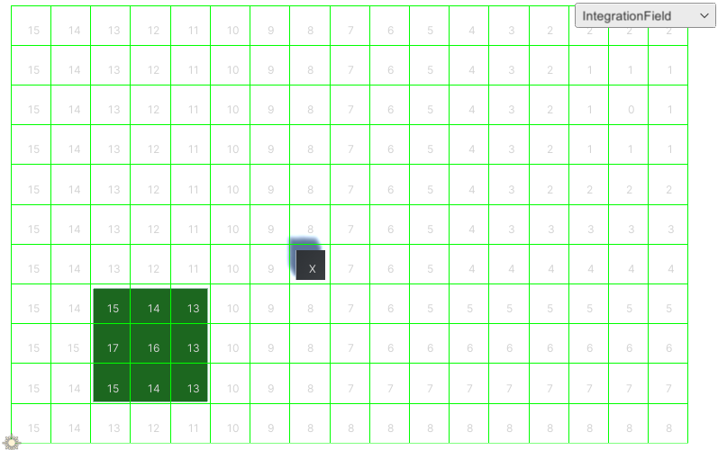
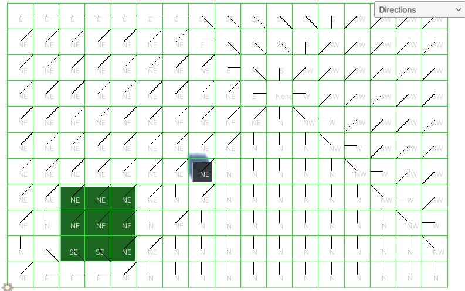

# FlowFields
## The Project
The Project consists out of a 2D Grid, where the player can spawn random agents. On the grid, the player will also be able to select an end target where the agents need to go. The agents will move according to the flow field grid. This flow flow field will be generated. The project will be made in Unity. 

### Controls
In The project there are several options the player can do. If the grid is bigger than the screen the user can move the camera with WASD. With the Q button, the user will be able to spawn the agents and R will destroy the agents. The "c" button will  toggle between the 2 types of obstacles (Walls and Grass). The Right click will set an destination point and will reset the Flowfield values. And finally right click will spawn the obstacles.

## What is a FlowField?
When talking about pathfinding, there are many solutions. One of them is Flow field pathfinding, also known as vector field pathfinding. What is special about flowfield pathfinding is that all the different agents will use the same path. If we look at A* each agent will calculate its own path. Flowfield are used because it is more efficient if you work with a huge amounts of agents. you dont need to calculate each path for all of the agents. 

## Implementation
A flow field consist of a grid, a cost field , an integration field and an flow field.
Before implementing the Flow field, a grid is needed. The grid will exist out of different cells, which will store all the data of field. The grid has already an grass spot and a wall placed on it.

### Cost Field
The Cost field will generate all the cost of a cell. The cost of a path can go between 1-254. How higher the cost, how rougher the area. The cost 255 is used to represent a wall. 0 will be the destination. When the cost field is changed, the integration field and the flow field will need the recalculate their values. To check if the cell has a higher cost. Each cell checks if there is collision with another object. If there is collision, it check wich layer the object has to determine the cost of the field.

### Integration Field
The Integration field will calculate the best cost of all the cells to the destination. This calculation will start from the destination point and will then add visit all the neigbors. The modified Dijksta algorithms will be used to determine all the path distance to the target. (calculation of the best cost to the destination). The main differce with the normal Dijkstra algorithms is that for a flowfield, The algorithms starts at the destination node and there is no start point.

### FlowField
Finally, for generating the flowfield. The grid takes all the result of the integration field and then tries to determine wich direction the agent should go. Each cell/node will look at its neighbors and compare their best cost. The direction that needs to be calculated, is that to the lowest best cost of one if the current cell/nodes neigbors.

## Sources
http://www.gameaipro.com/GameAIPro/GameAIPro_Chapter24_Efficient_Crowd_Simulation_for_Mobile_Games.pdf
https://leifnode.com/2013/12/flow-field-pathfinding/
https://gamedevelopment.tutsplus.com/tutorials/understanding-goal-based-vector-field-pathfinding--gamedev-9007
